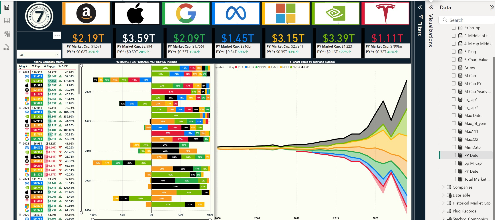
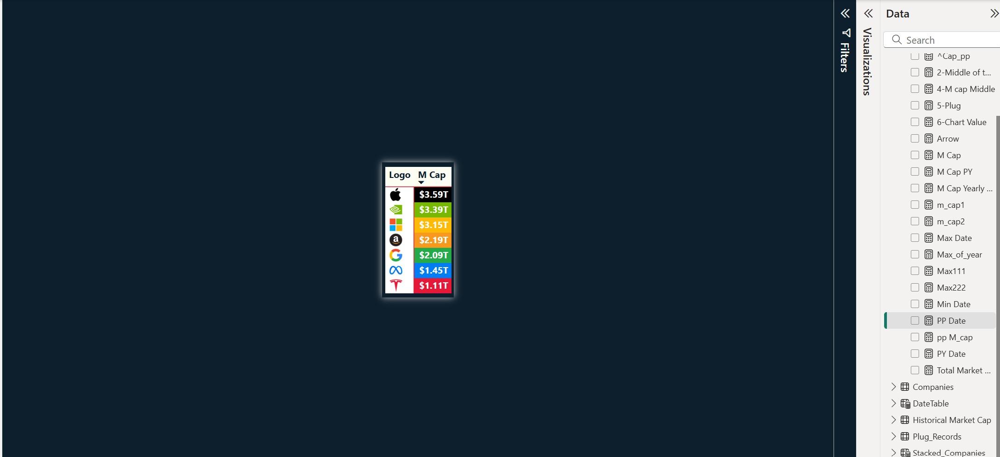

#  Magnificent 7 Market Cap Dashboard | Power BI 

This Power BI project visualizes the **market capitalization trends** of the world's top 7 tech giants — often referred to as the **Magnificent Seven** — offering deep, interactive insights into their financial growth over time.

---

##  Project Overview

Developed a **visually dynamic Power BI dashboard** that analyzes the **market capitalization** of the top 7 tech companies. The dashboard highlights **year-over-year growth trends**, company comparisons, and key metrics using advanced DAX and thoughtful UI design.

---

## Key Features

- **Interactive KPI Cards**  
  • Real-time market cap data displayed at the top  
  • Company logos integrated using **dynamic image URLs**  
  • **Color-coded conditional formatting** for easy distinction and engagement

- **100% Stacked Bar Chart**  
  • Visualizes **annual market cap distribution** across all 7 companies  
  • Easy to analyze how each company’s share of the market evolved over time

- **Stack Explosion Chart Effect**  
  • A **unique center-expanding chart** showing market cap growth  
  • Achieved using **duplicated data points and plug data** to create a center-aligned expansion effect  
  • Makes financial trends more visually intuitive and captivating

---

##  Tools & Technologies

- **Power BI**
- **DAX (Data Analysis Expressions)**
- **Conditional Formatting**
- **Dynamic Visuals**
- **Custom Chart Effects**

---

##  Insights Gained

- How the **top 7 tech companies** have grown over time
- Year-by-year changes in **market cap share**
- Which companies are dominating the tech sector and how their positions have shifted

---

##  Dashboard Preview

